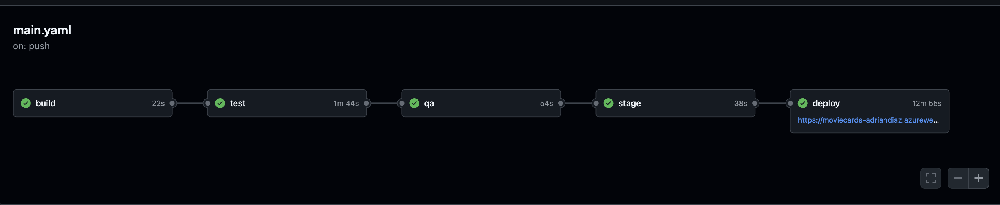
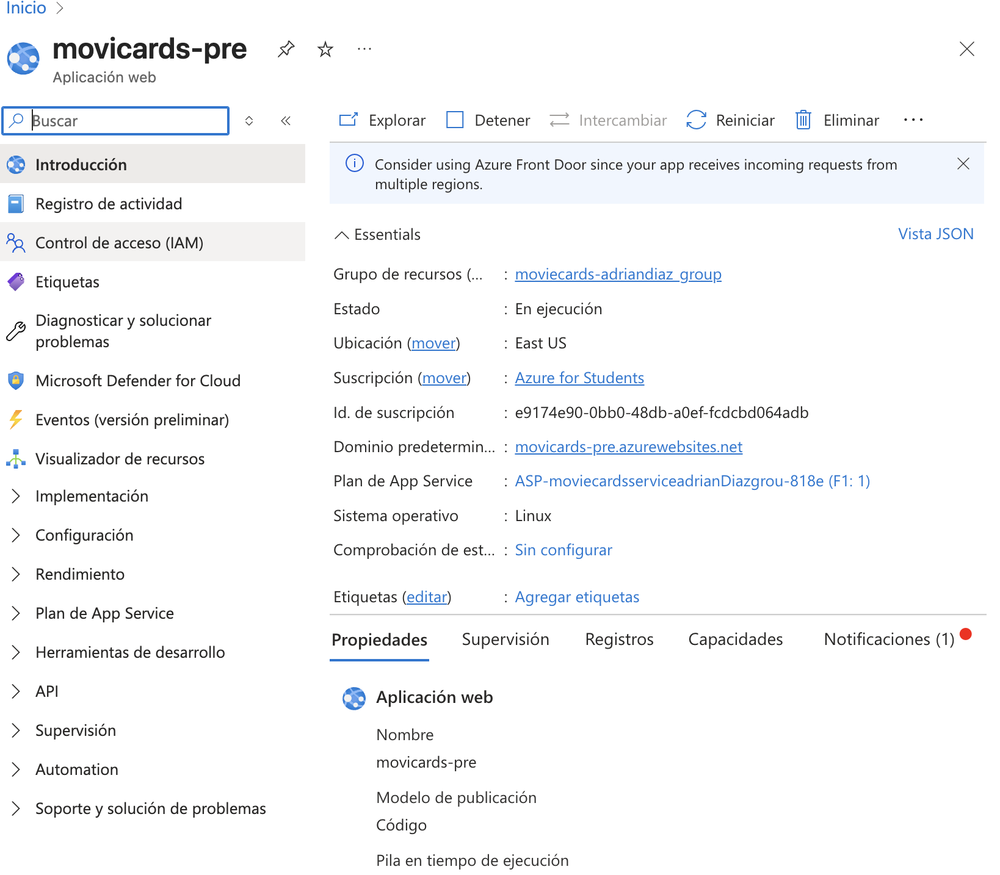
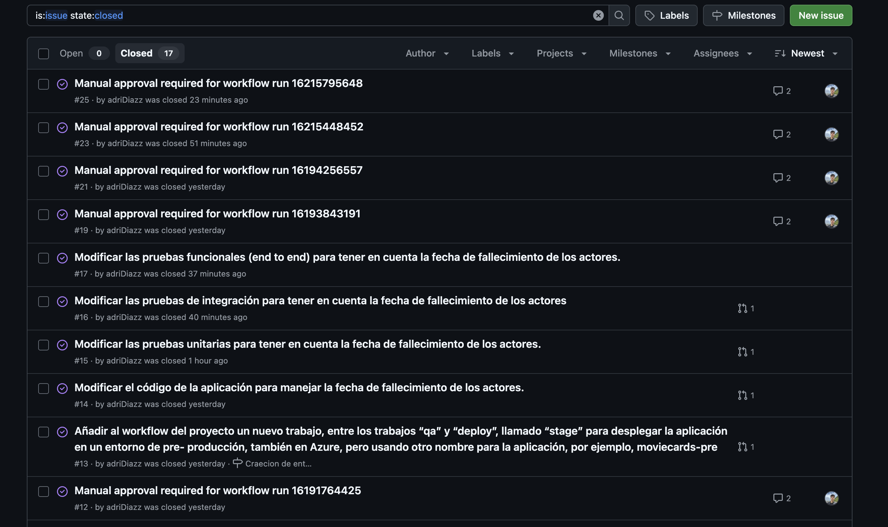

Adrián Díaz

Integración Continua en el Desarrollo Ágil

## 1. Introducción

Este documento recoge el proceso seguido para completar el trabajo final de la asignatura de Integración Continua. El objetivo principal ha sido aplicar buenas prácticas de desarrollo ágil y DevOps utilizando herramientas como GitHub, GitHub Actions, Azure, SonarQube y pruebas automatizadas sobre la aplicación moviecards.

## 2. Herramientas utilizadas

- GitHub: gestión de repositorios, issues, proyectos y Actions.

- Azure App Services: despliegue automático de aplicaciones web.

- SonarQube: control de calidad del código.

- Docker: contenedor SonarQube para el análisis local.

- JUnit + Mockito + Selenium: para pruebas automatizadas.

- GitHub Actions: para construir, probar y desplegar.

## 4. Modificaciones clave realizadas

### Servicio moviecards-service

Se reutilizó el repositorio proporcionado por el profesor. Se desplegó en Azure como moviecards-service-adrianDiaz. Desde la aplicación principal, se usa RestTemplate para consumirlo desde los dsitintos servicios de la aplicacion.

### Campo deadDate

Se añadió deadDate al modelo Actor.

```java
  @Id
    @GeneratedValue(strategy = GenerationType.AUTO)
    private Integer id;

    private String name;

    @DateTimeFormat(pattern = "yyyy-MM-dd")
    private Date birthDate;

    @DateTimeFormat(pattern = "yyyy-MM-dd")
    private Date deadDate;

    private String country;

    @ManyToMany(mappedBy = "actors")
    private List<Movie> movies;

```

Se actualizó el formulario HTML de creación de actores con un campo input type="date".

```HTML
 <div class="mb-3">
    <label for="deadDate" class="form-label">Fechanacimiento</label>
            <input type="date" class="form-control" th:field="*{deadDate}" id="deadDate" name="deadDate"
                placeholder="Escriba la fecha de fallecimiento" required="required" />
</div>
```

Se actualizó la tabla de listado de actores para mostrar esta fecha.

```java
<table class="table table-hover">
                <thead class="thead-light">
                <tr>
                    <th scope="col">Identificador</th>
                    <th scope="col">Nombre</th>
                    <th scope="col">Fecha Nacimiento</th>
                    <th scope="col">Fecha Fallecimiento</th>
                    <th scope="col">Pais</th>
                    <th scope="col">Editar</th>
                </tr>
                </thead>
                <tbody>
                <tr th:each="actor : ${actors}">
                    <td th:text="${actor.id}"></td>
                    <td th:text="${actor.name}"></td>
                    <td th:text="${#dates.format(actor.birthDate, 'dd-MM-yyyy')}"></td>
                    <td th:text="${#dates.format(actor.deadDate, 'dd-MM-yyyy')}"></td>
                    <td th:text="${actor.country}"></td>
                    <td>
                        <a th:href="@{'/editActor/' + ${actor.id}}" class="btn btn-primary">Editar</a>
                    </td>
                </tr>

                </tbody>
            </table>
```

Se actualizaron pruebas unitarias, de integración y end-to-end.

### Workflows

El archivo main.yaml incluía los siguientes jobs:

- build
- test
- qa
- deploy

Adicionalmente se ha añadido un entorno de pre-produccion, para esto se ha creado un nuevo job en el workflow:

#### stage

```yml
stage:
  needs: qa
  runs-on: ubuntu-latest
  if: github.ref == 'refs/heads/main'

  steps:
    - name: Download artifact from build job
      uses: actions/download-artifact@v4
      with:
        name: moviecards-java
    - name: Deploy to Azure Web App (Pre)
      id: deploy-to-pre
      uses: azure/webapps-deploy@v3
      with:
        app-name: "movicards-pre"
        slot-name: "Production"
        package: "*.jar"
        publish-profile: ${{ secrets.AZUREAPPSERVICE_PUBLISHPREPROFILE }}
```



Para la creacion de este entorno se ha tenido que crear un nuevo servicio 'appService' en azure, posterioremente se obtiene el secreto AZUREAPPSERVICE_PUBLISHPREPROFILE, para permitir el despliegue desde nuestro nuevo job.



## 5. Gestión del proyecto

Se utilizó el sistema de issues de GitHub para organizar cada fase ademas, cada issue fue implementado en una rama independiente, y luego se integró en main.



## 6. Conclusión

Este proyecto ha permitido aplicar de forma completa un flujo de trabajo DevOps realista con integración continua, despliegue automático y control de calidad, mejorar mi uso de github y github actions.
Ademas se han utilizado entornos separados para preproducción y producción, lo que mejora la robustez del ciclo de vida de desarrollo.
